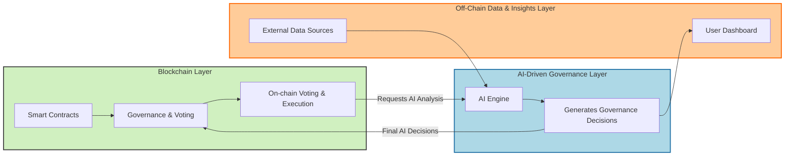
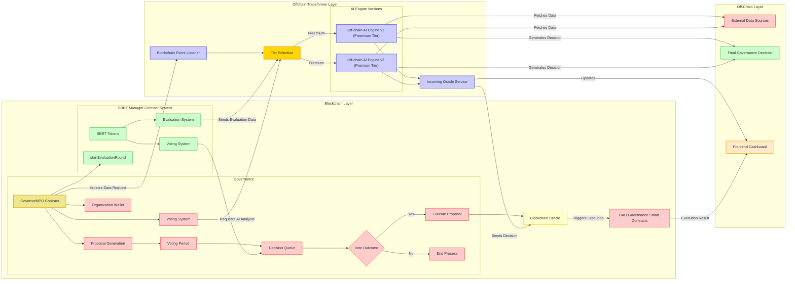
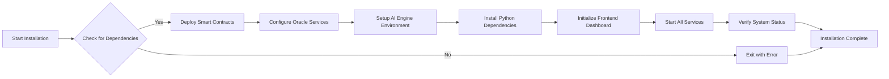

# SuperDAO: AI-Driven DAO Governance System: High-Level Project Overview

This project outlines an AI-enhanced Decentralized Autonomous Organization (DAO) governance system that integrates blockchain technology with advanced AI models (specifically Transformer architectures). The system is designed to facilitate intelligent, transparent, and efficient decision-making within a DAO.

## Architecture Overview

The system consists of three primary layers as well as the installation workflow:

- **Blockchain Layer**: Manages on-chain governance, smart contracts, SBRT tokens, and the voting mechanism.
- **AI-Driven Governance Layer**: Acts as an intelligent off-chain intermediary, processing data using AI models with encoder and decoder components.
- **Off-Chain Data & Insights Layer**: Interacts with external data sources to provide enriched data for informed decision-making.

### High Level Service Model

The system includes several key services that interact across the three layers.



### Components:

- **GovernorNPO Contract**: Core smart contract for DAO governance.
- **SBRT Manager Contract**: Manages SBRT tokens and evaluation rounds.
- **Voting System**: Collects votes from SBRT token holders.
- **Blockchain Oracle**: Facilitates communication between on-chain and off-chain components.
- **Blockchain Event Listener**: Monitors blockchain events to trigger data processing.
- **Outgoing/Incoming Oracle Services**: Handle data requests and responses between the blockchain and AI engine.
- **Off-chain AI Engine**: Processes data using Transformer models to provide AI-driven insights.
- **External Data Sources**: Provide additional data for the AI engine to process.
- **Frontend Dashboard**: Interface for DAO members to view updates and participate in governance.

### On/Off Chain Layer + Transformer


### Inter-Layer Connections

- **Blockchain Layer to Transformer Layer**:
    - **GovernorNPO Contract** initiates data requests to the Blockchain Event Listener in the Transformer Layer.
    - **Voting System** requests AI analysis from the Off-chain AI Engine in the Transformer Layer.
    - **Evaluation System** sends evaluation data to the Off-chain AI Engine.

- **Transformer Layer to Blockchain Layer**:
    - **Incoming Oracle Service** sends AI decisions back to the Blockchain Oracle, which then triggers execution in the DAO Governance Smart Contracts.

- **Transformer Layer to Off-Chain Layer**:
    - **Off-chain AI Engine** interacts with External Data Sources in the Off-Chain Layer to fetch necessary data.
    - **Incoming Oracle Service** updates the Frontend Dashboard in the Off-Chain Layer with AI-generated insights.

### AI Engine Layer

```mermaid
graph LR
    %% Input to Encoder (outside the encoder box)
    Sources --> Embedding_Enc[Embedding]
    Positional_Encoding_Enc[Positional Encoding] --> AddOperation_Enc[ADD Operation]
    Embedding_Enc --> AddOperation_Enc
    AddOperation_Enc --> A1

    %% Input to Decoder (outside the decoder box)
    Targets --> Embedding_Dec[Embedding]
    Positional_Encoding_Dec[Positional Encoding] --> AddOperation_Dec[ADD Operation]
    Embedding_Dec --> AddOperation_Dec
    AddOperation_Dec --> D1

    %% Encoder internals with label "n X"
    subgraph Encoder [n X]
        A1[Multi-head Attention] --> A2[Add & Norm]
        A2 --> A1
        A2 --> A3[Positionwise FFN] --> A4[Add & Norm]
        A4 --> A3
    end

    %% Decoder internals with label "X n"
    subgraph Decoder [X n]
        D1[Masked Multi-head Attention] --> D2[Add & Norm]
        D2 --> D1
        D2 --> D3[Multi-head Attention] --> D4[Add & Norm]
        D4 --> D3
        D4 --> D5[Positionwise FFN] --> D6[Add & Norm]
        D6 --> D5
    end

    %% Cross-connection from Encoder to Decoder
    A4 --> D3

    %% Final Output to Fully Connected Layer (FC)
    D6 --> FC[Fully Connected]

    %% Apply lighter colors and styles
    classDef embeddingColor fill:#d4af37,stroke:#c47f17,stroke-width:1px;
    classDef attentionColor fill:#d4e6d0,stroke:#90be6d,stroke-width:1px;
    classDef maskedAttentionColor fill:#cbe6c9,stroke:#6dab6e,stroke-width:1px;
    classDef addNormColor fill:#dae4ea,stroke:#577590,stroke-width:1px;
    classDef ffnColor fill:#f9b8a4,stroke:#f94144,stroke-width:1px;
    classDef fullyConnectedColor fill:#b4dfe5,stroke:#277da1,stroke-width:1px;
    classDef encoderColor fill:#fff3cd,stroke:#ffbe0b,stroke-width:1px;
    classDef decoderColor fill:#e3d5f5,stroke:#8338ec,stroke-width:1px;
    classDef addOperationColor fill:#f3e5ab,stroke:#f1c40f,stroke-width:1px;
    classDef positionalEncodingColor fill:#afe9ff,stroke:#0096d1,stroke-width:1px;

    %% Assign classes to the nodes and subgraphs
    class Embedding_Enc,Embedding_Dec embeddingColor;
    class AddOperation_Enc,AddOperation_Dec addOperationColor;
    class Positional_Encoding_Enc,Positional_Encoding_Dec positionalEncodingColor;
    class A1,D3 attentionColor;
    class D1 maskedAttentionColor;
    class A2,A4,D2,D4,D6 addNormColor;
    class A3,D5 ffnColor;
    class FC fullyConnectedColor;
    class Encoder encoderColor;
    class Decoder decoderColor;
```



The **Encoder** and **Decoder** are two core components of the Transformer architecture, each serving distinct roles but working together seamlessly.

- **Encoder**
    - The **Encoder** processes the **input sequence** (e.g., a sentence in a translation task) and transforms it into a rich, context-aware representation.
    - It operates by applying layers of **Multi-head Attention** and **Feed-Forward Networks**, allowing the model to understand relationships between tokens within the input.
    - The output of the encoder is a detailed representation of the input sequence but doesn't produce any final output itself.

- **Decoder**
    - The **Decoder** generates the **output sequence** (e.g., the translated sentence), one token at a time.
    - It first uses **Masked Multi-head Attention** to process the previously generated tokens, ensuring that future tokens in the sequence are not considered prematurely.
    - Then, the decoder uses **Cross-Attention** to focus on the **Encoder’s output**, leveraging the context from the input sequence to produce accurate, context-aware predictions.
    - The final step is a **Fully Connected Layer** that predicts the next token in the sequence.

- **Link Between Encoder & Decoder**
    - The **Cross-Attention** mechanism in the decoder is where the two components link. The decoder attends to the **Encoder's output**, using this information to generate relevant output tokens. This connection allows the model to combine the input’s context with the decoder’s output, resulting in accurate and fluent predictions.

## Installation Flow

The installation process sets up the entire system, including smart contracts deployment, AI engine setup, and oracle services configuration.



### Proposed Project File Structure

```plaintext
.
├── src/                               # Source directory containing smart contracts and AI modules
│   ├── contracts/                     # Smart contracts for DAO governance
│   │   ├── GovernorNPO.sol            # Core governance contract
│   │   ├── SBRTManager.sol            # Contract managing SBRT tokens
│   │   └── DAOContracts.sol           # Additional DAO governance contracts
│   ├── ai_engine/                     # AI engine utilizing Transformer models
│   │   ├── ai_processor.py            # Processes data with encoder/decoder layers
│   │   ├── data_fetcher.py            # Fetches data from external sources
│   │   └── requirements.txt           # Python dependencies for AI engine
│   ├── oracle_services/               # Oracle services bridging blockchain and AI engine
│   │   ├── outgoing_oracle.py         # Sends data requests to AI engine
│   │   ├── incoming_oracle.py         # Receives AI decisions and updates blockchain
│   └── utils/                         # Utility scripts and common functions
│       ├── event_listener.py          # Monitors blockchain events
│       └── logger.py                  # Logging utility
├── diagrams/                          # Architecture diagrams and flowcharts
│   └── various_architectures.mermaid  # TBD
├── install.sh                         # Installation script for deploying the system
├── uninstall.sh                       # Uninstallation script to remove the system
├── README.md                          # Project documentation (this file)
└── frontend/                          # Frontend dashboard for DAO members
    ├── index.html                     # Main HTML file
    ├── styles.css                     # Stylesheets
    └── app.js                         # JavaScript for dynamic content
```

### Installation Steps:

- **Check for Dependencies**: Ensure that all required tools and dependancies are installed.
- **Deploy Smart Contracts**: Compile and deploy the smart contracts to the blockchain network.
- **Configure Oracle Services**: Set up the outgoing and incoming oracle services to communicate between the blockchain and the AI engine.
- **Setup AI Engine Environment**: Create a virtual environment and install necessary Python packages.
- **Initialize Frontend Dashboard**: Deploy the frontend interface for DAO members.
- **Start All Services**: Launch the oracle services and the AI engine.
- **Verify System Status**: Check that all components are running correctly.

### Third-Party Libraries and Frameworks:

- **Blockchain Layer**
    - **Solidity**: Used for writing smart contracts.
    - **OpenZeppelin Contracts**: Provides secure and community-vetted smart contract templates.
    - **Web3.js**: Allows interaction with the blockchain from JavaScript applications.

- **Transformer Layer**
    - **Python Libraries**:
        - **TensorFlow / PyTorch**: Used for implementing Transformer models.
        - **Requests**: For making HTTP requests to external APIs.
        - **Asyncio**: To handle asynchronous operations in the AI engine.

- **Off-Chain Layer**
    - **APIs and Data Sources**: Various external APIs providing market data, social media sentiment, etc.
    - **Frontend Framework**:
        - **React.js**: For building a dynamic and responsive frontend dashboard.
